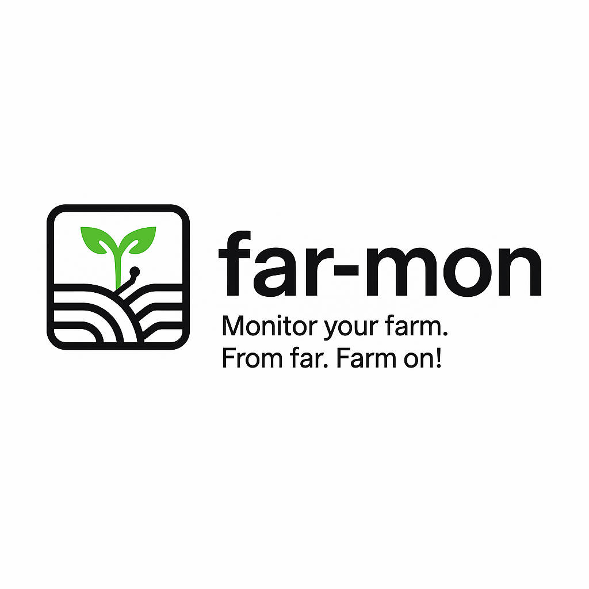
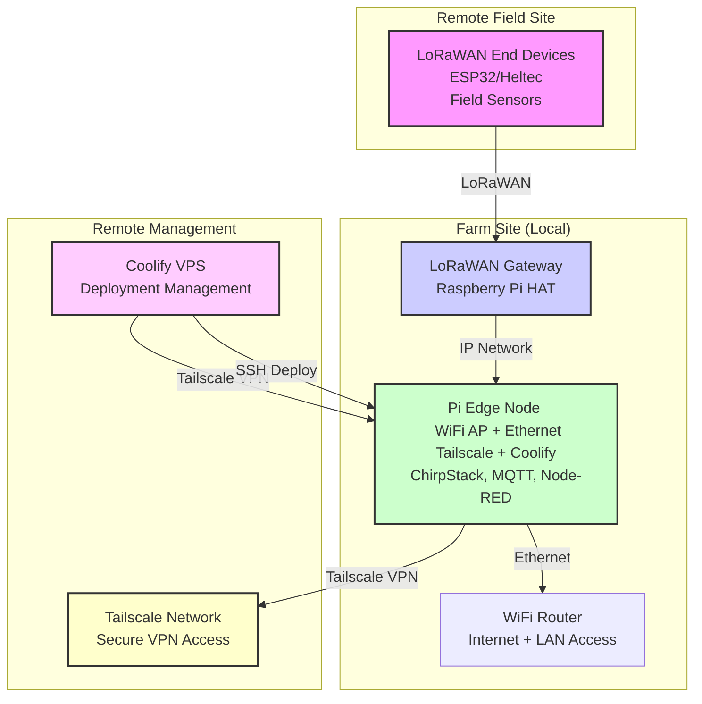

# far-mon

**Monitor your farm. From far. Farm on!**

A modular, resilient farm-monitoring platform that **consolidates resources** and **plugs into** ERPNext (or any farm ERP) for unified record-keeping and analytics.

---

## 🎯 Why far-mon?

1. **Data-Driven Decisions**  
   Turn raw sensor data into interventions that boost yield, efficiency, and water-use.
2. **Edge-First Resilience**  
   Low-maintenance, offline-capable nodes keep running—even when the network flutters.
3. **ERP-Agnostic Integration**  
   Focus on monitoring and control; let ERPNext handle inventory, finance, traceability.

---

## 🏗️ High-Level Architecture

> **Note:** This system is currently undergoing a strategic migration from a custom LoRa protocol to the industry-standard LoRaWAN protocol. The architecture described below reflects the target state. For details on the phased migration, see the [LoRaWAN Migration Guide](edge/heltec/LoRaWAN_migration_guide.md).

- **Remote Nodes (LoRaWAN End Devices)**
  – ESP32/Heltec devices refactored to be LoRaWAN Class A compliant.
  – Firmware supports an AT command interface for remote configuration via downlinks.
  – Battery-powered with solar charging.
- **LoRaWAN Gateway**
  – Replaces the original Heltec `relay` node.
  – A standard LoRaWAN gateway (e.g., Raspberry Pi with an SX1302 HAT).
  – Forwards raw LoRaWAN packets to the Network Server (ChirpStack) on the Pi Edge Node.
  – _Transitional Phase_: The existing Heltec `relay` node will temporarily act as a minimal packet forwarder until the gateway hardware is deployed.
- **Pi Edge Node**
  – Runs the core network services in Docker containers managed by Coolify.
  – **LoRaWAN Network Server (ChirpStack)**: Manages the LoRaWAN network, devices, and forwards decoded data to MQTT.
  – MQTT broker, Node-RED automation, InfluxDB storage.
  – Tailscale VPN for secure remote access.
- **Management Layer**
  – Coolify VPS for deployment orchestration
  – Tailscale network for secure connectivity
  – SSH tunneling for device access
  – GitOps workflow for updates

---

## ⚙️ Capabilities (MVP)

| Domain    | What we measure                 | Hardware / Method                |
| --------- | ------------------------------- | -------------------------------- |
| Water     | Tank level, borehole flow, rain | HC-SR04, tipping bucket, API     |
| Soil      | Moisture                        | Capacitive probes                |
| Livestock | Goat weight, health             | Manual scale or RFID gate        |
| Fodder    | Harvest time, regrowth rate     | Logs + moisture probe            |
| Hives     | Temp, humidity, activity        | Thermal probe, IR motion counter |
| System    | Uptime, solar output, leaks     | Pulse counters, shunt sensors    |

_All measurements flow through SensorConfig → Pi → ERPNext (or dashboard)._

---

## 🚀 MVP Action Items

1. **Tank Monitoring** – Over-/under-flow alerts
2. **Rain Gauge** – Irrigation suppression logic
3. **Soil Moisture** – Dynamic irrigation triggers
4. **Goat Weighing** – Growth tracking dashboard
5. **Crop Events** – Mobile form logging
6. **Hive Health** – Pre-swarm warnings

---

## 🔌 Near-Term Extensions

- **Sunverter 4b** (RS-485) → Solar metrics
- **Pump Runtime** → Efficiency analytics
- **Zonal Nodes** → Per-plot decisions
- **Local Dashboard** → Web UI on Pi
- **Rule Engine** → Configurable thresholds

---

## 📆 ERPNext Integration Roadmap

1. **Device Registry** in ERPNext for sensor metadata
2. **Time-Series Bridge** (Pi → MQTT/REST → ERPNext)
3. **Offline Mobile Forms** (goats, crops, maintenance)
4. **Auto-Reports** for yield, water use, cost vs. field conditions
5. **ERP Hooks** for livestock, crop, inventory sync

---

## 🚀 Getting Started

For detailed documentation, please see the [Farm Monitoring System Documentation](docs/README.md).
