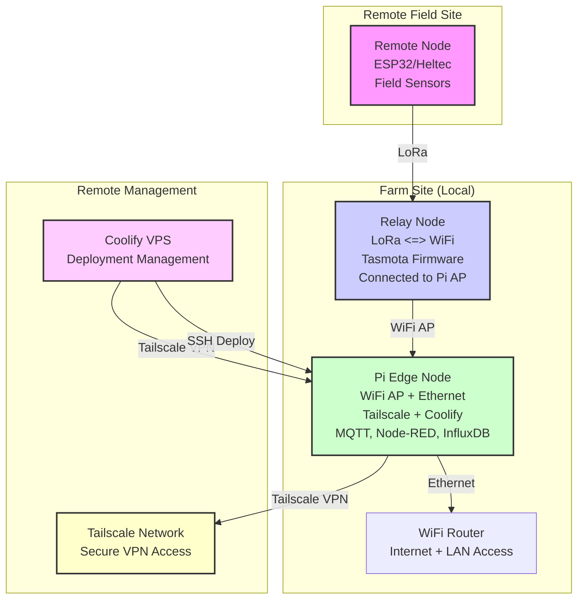

# far-mon  
**Monitor your farm. From far. Farm on!**

A modular, resilient farm-monitoring platform that **consolidates resources** and **plugs into** ERPNext (or any farm ERP) for unified record-keeping and analytics.

---

## 🎯 Why far-mon?

1. **Data-Driven Decisions**  
   Turn raw sensor data into interventions that boost yield, efficiency, and water-use.  
2. **Edge-First Resilience**  
   Low-maintenance, offline-capable nodes keep running—even when the network flutters.  
3. **ERP-Agnostic Integration**  
   Focus on monitoring and control; let ERPNext handle inventory, finance, traceability.

---

## 🏗️ High-Level Architecture

- **Remote Nodes**  
  – ESP32/Heltec devices in field locations  
  – Configurable firmware with GPIO management  
  – Battery-powered with solar charging  
- **Relay Nodes**  
  – LoRa ↔ WiFi bridge with Tasmota firmware  
  – Connects to Pi WiFi Access Point  
  – Web UI for configuration and OTA updates  
  – Bidirectional command dispatch  
- **Pi Edge Node**  
  – Ethernet connection for internet access  
  – WiFi Access Point for relay devices  
  – Tailscale VPN for secure remote access  
  – Coolify-managed containerized services  
  – MQTT broker, Node-RED automation, InfluxDB storage  
- **Management Layer**  
  – Coolify VPS for deployment orchestration  
  – Tailscale network for secure connectivity  
  – SSH tunneling for device access  
  – GitOps workflow for updates  

---

## ⚙️ Capabilities (MVP)

| Domain       | What we measure                   | Hardware / Method                |
|-------------|-----------------------------------|----------------------------------|
| Water       | Tank level, borehole flow, rain   | HC-SR04, tipping bucket, API     |
| Soil        | Moisture                          | Capacitive probes                |
| Livestock   | Goat weight, health              | Manual scale or RFID gate        |
| Fodder      | Harvest time, regrowth rate      | Logs + moisture probe            |
| Hives       | Temp, humidity, activity         | Thermal probe, IR motion counter |
| System      | Uptime, solar output, leaks      | Pulse counters, shunt sensors    |

_All measurements flow through SensorConfig → Pi → ERPNext (or dashboard)._

---

## 🚀 MVP Action Items

1. **Tank Monitoring** – Over-/under-flow alerts  
2. **Rain Gauge** – Irrigation suppression logic  
3. **Soil Moisture** – Dynamic irrigation triggers  
4. **Goat Weighing** – Growth tracking dashboard  
5. **Crop Events** – Mobile form logging  
6. **Hive Health** – Pre-swarm warnings  

---

## 🔌 Near-Term Extensions

- **Sunverter 4b** (RS-485) → Solar metrics  
- **Pump Runtime** → Efficiency analytics  
- **Zonal Nodes** → Per-plot decisions  
- **Local Dashboard** → Web UI on Pi  
- **Rule Engine** → Configurable thresholds  

---

## 📆 ERPNext Integration Roadmap

1. **Device Registry** in ERPNext for sensor metadata  
2. **Time-Series Bridge** (Pi → MQTT/REST → ERPNext)  
3. **Offline Mobile Forms** (goats, crops, maintenance)  
4. **Auto-Reports** for yield, water use, cost vs. field conditions  
5. **ERP Hooks** for livestock, crop, inventory sync  

---

## 🚀 Getting Started

For detailed documentation, please see the [Farm Monitoring System Documentation](docs/README.md).
