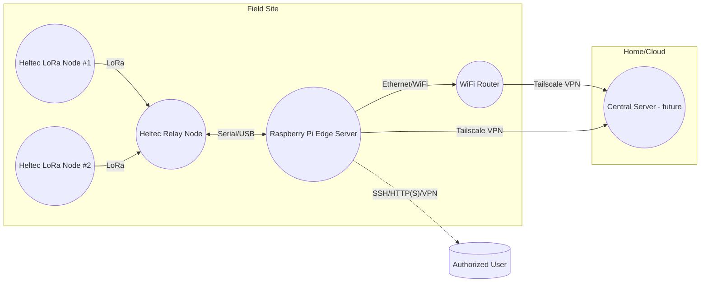

# 1. System Overview

This document provides a high-level overview of the farm monitoring system's architecture, components, and data flow.

## 1.1. System Topology

The system is composed of remote sensor nodes that collect data and transmit it to a central on-site server (Raspberry Pi) via a relay node.

## 1.2. Layered Architecture

### A. Physical Layer

| Component      | Details                                                    |
| :------------- | :--------------------------------------------------------- |
| Remote Heltec  | WiFi LoRa 32 (V3), deployed in the remote field.           |
| Relay Heltec   | WiFi LoRa 32 (V3), located near the Raspberry Pi.          |
| Raspberry Pi   | Model 3/4, runs all edge services.                         |
| WiFi Router    | Provides local networking at the farm site.                |
| Sensors        | Sunverter 4b (RS485/Serial), water flow/level, env sensors.|
| Power          | Mains/solar as per site requirements.                      |

### B. Data & Communication Layer

| Path                           | Protocol        | Details                                                 |
| :----------------------------- | :-------------- | :------------------------------------------------------ |
| Remote Heltec → Relay Heltec   | LoRa (Semtech)  | Uplink sensor data, 433/868/915 MHz as per region.      |
| Relay Heltec → Pi              | Serial/USB UART | Binary/text packets; bidirectional for configuration.     |
| Pi → ThingsBoard (internal)    | MQTT/HTTP       | Standard ThingsBoard device telemetry API.              |
| Pi → User                      | HTTP(S), VPN    | Dashboard, SSH admin, secured by Tailscale VPN.         |
| Pi ↔ CoreServer (future)       | VPN/MQTT/HTTP   | For ETL, sync, and centralized analytics.               |

### C. Logical/Software Layer

| Layer/Module      | Description                                                               |
| :---------------- | :------------------------------------------------------------------------ |
| Remote Firmware   | Minimalist firmware for sensor reading, data packing, and LoRa TX/config RX. |
| Relay Firmware    | Handles LoRa RX/TX, serial bridging, configuration, and ACK logic.        |
| Pi Edge Stack     | Dockerized ThingsBoard, relay-bridge service (serial↔MQTT/HTTP), VPN, logging. |
| Shared Protocols  | All nodes use the same serialization/packing from `/shared`.              |
| User Interface    | ThingsBoard dashboards, configuration widgets, and SSH access via VPN.    |
| Future Core       | Central analytics, synchronization, and long-term backup (optional).      |

## 1.3. Information Flow

### A. Sensor Data Path (Uplink)

1.  **Remote Heltec**:
    *   Reads data from all attached sensors (e.g., Sunverter 4b, tank level, flow meters).
    *   Packs the readings into a fixed-format binary structure.
    *   Transmits the data packet over LoRa to the relay node at a predefined interval.
2.  **Relay Heltec**:
    *   Listens for incoming LoRa packets from remote nodes.
    *   Forwards the sensor packets to the Raspberry Pi via USB serial.
3.  **Raspberry Pi (Edge Server)**:
    *   The `relay-bridge` service reads the serial data, validates it, and forwards it to ThingsBoard using the MQTT or HTTP telemetry API.
    *   ThingsBoard stores, visualizes, and processes the incoming telemetry data.
4.  **User**:
    *   Connects to the system via Tailscale VPN to access the ThingsBoard dashboard for monitoring and administration (SSH).

### B. Configuration & Downlink Path

1.  **User/ThingsBoard UI**:
    *   The user sends configuration changes (e.g., sample rate, sensor settings) via the ThingsBoard dashboard.
2.  **ThingsBoard → Pi relay-bridge**:
    *   The `relay-bridge` service receives the configuration update command from ThingsBoard.
3.  **Pi relay-bridge → Relay Heltec**:
    *   The service encodes the configuration into a packet and sends it to the relay node via serial.
4.  **Relay Heltec → Remote Heltec**:
    *   The relay node broadcasts the configuration packet over LoRa and waits for an acknowledgment.
5.  **Remote Heltec**:
    *   Listens for configuration updates after each transmission.
    *   If a valid configuration is received, it is stored in flash memory, and an ACK is sent in the next uplink.
