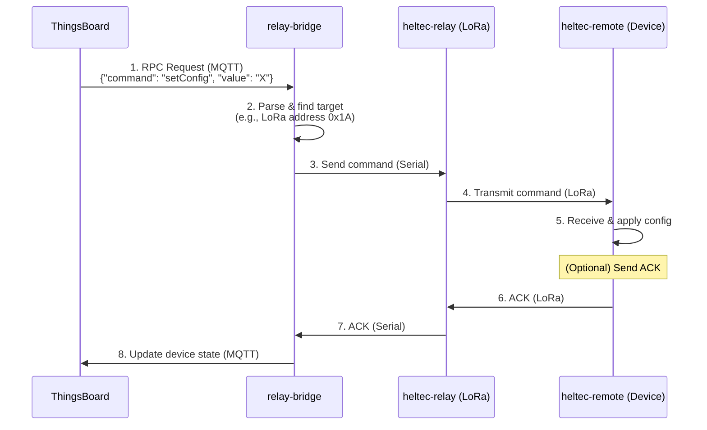

# 4. Protocols

This document outlines the communication protocols used in the farm monitoring system.

## 4.1. Uplink: Device to Server

Uplink communication sends sensor data from the end devices to the server.

1.  **Sensor Reading**: The `heltec-remote` reads data from its sensors.
2.  **LoRa Transmission**: The data is broadcast as a LoRa packet.
3.  **Relay Reception**: The `heltec-relay` receives the LoRa packet and writes it to its serial port.
4.  **Bridge Processing**: The `relay-bridge` reads the data from the serial port.
5.  **ThingsBoard Telemetry**: The `relay-bridge` publishes the data to the ThingsBoard MQTT broker on the `v1/devices/me/telemetry` topic.

## 4.2. Downlink: Server to Device (Configuration Updates)

Downlink communication sends commands or configuration updates from the server to the end devices. This is typically initiated via a **Remote Procedure Call (RPC)** from the ThingsBoard dashboard.

### 4.2.1. Flow

### 4.2.2. Description

1.  **RPC from ThingsBoard**: An operator sends a command to a device from the ThingsBoard dashboard. ThingsBoard publishes this as an MQTT message to the `v1/devices/me/rpc/request/+` topic.

2.  **`relay-bridge` Receives**: The `relay-bridge` is subscribed to this topic. It receives the message and parses the command.

3.  **Command to Serial**: The `relay-bridge` translates the command into a format understood by the `heltec-relay` and sends it over the serial port. This includes the address of the target LoRa device.

4.  **LoRa Transmission**: The `heltec-relay` transmits the command as a LoRa packet.

5.  **Device Execution**: The target `heltec-remote` receives the packet, verifies its address, and executes the command.

6.  **Acknowledgement (Optional)**: The device can send an acknowledgement back to the `relay-bridge`, which can then update the RPC status in ThingsBoard.
