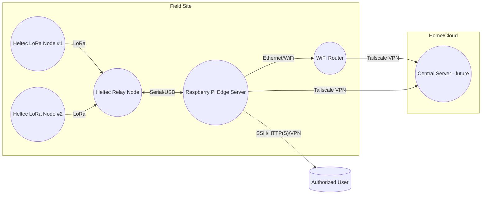
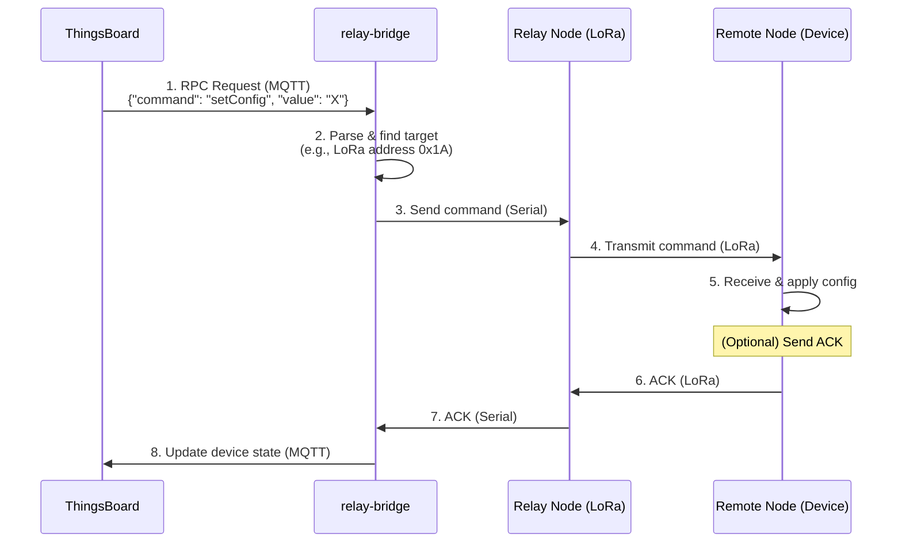

# Farm Monitoring System Documentation

This document provides a comprehensive overview of the farm monitoring system, from high-level architecture to low-level implementation details.

## Table of Contents

1.  [System Overview](#1-system-overview)
2.  [Hardware](#2-hardware)
3.  [Firmware](#3-firmware)
    - [Remote Sensor Node (`remote`)](#31-remote-sensor-node)
    - [Relay Node (`relay`)](#32-relay-node)
4.  [Communication Protocols](#4-communication-protocols)
5.  [Raspberry Pi Setup](#5-raspberry-pi-setup)
6.  [Deployment Guide](#6-deployment-guide)
7.  [Maintenance and Extensibility](#7-maintenance-and-extensibility)

## 1. System Overview

The farm monitoring system is a modular, resilient platform that consolidates resources and plugs into ERPNext (or any farm ERP) for unified record-keeping and analytics.

### 1.1. System Topology

The system is composed of remote sensor nodes that collect data and transmit it to a central on-site server (Raspberry Pi) via a relay node.



### 1.2. Layered Architecture

#### A. Physical Layer

| Component | Details |
| :--- | :--- |
| Remote Heltec | WiFi LoRa 32 (V3), deployed in the remote field. |
| Relay Heltec | WiFi LoRa 32 (V3), located near the Raspberry Pi. |
| Raspberry Pi | Model 3/4, runs all edge services. |
| WiFi Router | Provides local networking at the farm site. |
| Sensors | Sunverter 4b (RS485/Serial), water flow/level, env sensors. |
| Power | Mains/solar as per site requirements. |

#### B. Data & Communication Layer

| Path | Protocol | Details |
| :--- | :--- | :--- |
| Remote Heltec → Relay Heltec | LoRa (Semtech) | Uplink sensor data, 433/868/915 MHz as per region. |
| Relay Heltec → Pi | Serial/USB UART | Binary/text packets; bidirectional for configuration. |
| Pi → ThingsBoard (internal) | MQTT/HTTP | Standard ThingsBoard device telemetry API. |
| Pi → User | HTTP(S), VPN | Dashboard, SSH admin, secured by Tailscale VPN. |
| Pi ↔ CoreServer (future) | VPN/MQTT/HTTP | For ETL, sync, and centralized analytics. |

#### C. Logical/Software Layer

| Layer/Module | Description |
| :--- | :--- |
| Remote Firmware | Minimalist firmware for sensor reading, data packing, and LoRa TX/config RX. |
| Relay Firmware | Handles LoRa RX/TX, serial bridging, configuration, and ACK logic. |
| Pi Edge Stack | Dockerized ThingsBoard, relay-bridge service (serial↔MQTT/HTTP), VPN, logging. |
| Shared Protocols | All nodes use the same serialization/packing from `/shared`. |
| User Interface | ThingsBoard dashboards, configuration widgets, and SSH access via VPN. |
| Future Core | Central analytics, synchronization, and long-term backup (optional). |

### 1.3. Information Flow

#### A. Sensor Data Path (Uplink)

1.  **Remote Heltec**:
    -   Reads data from all attached sensors (e.g., Sunverter 4b, tank level, flow meters).
    -   Packs the readings into a fixed-format binary structure.
    -   Transmits the data packet over LoRa to the relay node at a predefined interval.
2.  **Relay Heltec**:
    -   Listens for incoming LoRa packets from remote nodes.
    -   Forwards the sensor packets to the Raspberry Pi via USB serial.
3.  **Raspberry Pi (Edge Server)**:
    -   The `relay-bridge` service reads the serial data, validates it, and forwards it to ThingsBoard using the MQTT or HTTP telemetry API.
    -   ThingsBoard stores, visualizes, and processes the incoming telemetry data.
4.  **User**:
    -   Connects to the system via Tailscale VPN to access the ThingsBoard dashboard for monitoring and administration (SSH).

#### B. Configuration & Downlink Path

1.  **User/ThingsBoard UI**:
    -   The user sends configuration changes (e.g., sample rate, sensor settings) via the ThingsBoard dashboard.
2.  **ThingsBoard → Pi relay-bridge**:
    -   The `relay-bridge` service receives the configuration update command from ThingsBoard.
3.  **Pi relay-bridge → Relay Heltec**:
    -   The service encodes the configuration into a packet and sends it to the relay node via serial.
4.  **Relay Heltec → Remote Heltec**:
    -   The relay node broadcasts the configuration packet over LoRa and waits for an acknowledgment.
5.  **Remote Heltec**:
    -   Listens for configuration updates after each transmission.
    -   If a valid configuration is received, it is stored in flash memory, and an ACK is sent in the next uplink.

## 2. Hardware

This section details the hardware components used in the farm monitoring system.

### 2.1. Core Components

| Component | Model | Role |
| :--- | :--- | :--- |
| Edge Server | Raspberry Pi 3 or 4 | Hosts ThingsBoard and the relay bridge. |
| Remote Node | Heltec WiFi LoRa 32 (V3) | Collects sensor data in the field. |
| Relay Node | Heltec WiFi LoRa 32 (V3) | Relays data between remote nodes and the Pi. |

### 2.2. Sensor Details

The system supports a variety of sensors, which are configured in the remote node's firmware.

-   **Sunverter 4b**: Connected via a [TTL-to-RS485 converter](https://www.pixelelectric.com/electronic-modules/miscellaneous-modules/logic-converter/ttl-to-rs485-automatic-control-module/) for monitoring solar power systems.
-   **Water Level Sensors**: Analog or ultrasonic sensors for tank monitoring.
-   **Flow Meters**: Pulse-based sensors to measure water flow at critical points:
    -   Borehole to tank
    -   Tank to domestic supply
    -   Tank to farm
    -   Domestic supply to sales
-   **Environmental Sensors**: Optional sensors for temperature, humidity, etc.

### 2.3. Power Systems

-   **Remote Node Power**: Each remote node is powered by a small, repurposed solar panel, a charging circuit, and a single 18650 battery cell. This setup is designed for high availability in a region with abundant sun, providing up to 3 days of autonomy in worst-case scenarios.
-   **Raspberry Pi Power**: The Pi is housed indoors and connected to a UPS or battery backup for resilience against power outages.

### 2.4. Physical Deployment

-   **Remote Nodes**:
    -   Placed at sensor cluster points (e.g., by the borehole, water tank).
    -   The LoRa antenna should be positioned for optimal line-of-sight to the relay node.
-   **Relay Node**:
    -   Located near the Raspberry Pi, typically indoors.
    -   Connected to the Pi via USB.
    -   Positioned for the best possible LoRa reception from all remote nodes.
-   **Raspberry Pi**:
    -   Housed indoors, protected from dust and moisture.
    -   Connected to the local network via Ethernet or WiFi.

## 3. Firmware

This section provides a high-level overview of the firmware for the remote and relay nodes.

### 3.1. Remote Sensor Node (`remote`)

The remote node's firmware is designed for minimal power consumption and reliable, config-driven operation. It collects data from sensors and transmits it to the relay node.

#### Responsibilities

-   **Collect data** from attached sensors (Sunverter, tank level, flow meters, etc.).
-   **Package readings** into a compact payload for LoRa transmission.
-   **Transmit** data at fixed intervals.
-   **Listen** for downlink configuration packets to update settings.
-   **Persist** configuration in flash memory.
-   **Acknowledge** configuration changes in the next uplink.

#### Data Structures

The firmware uses a set of C++ structs to manage configuration.

##### `SensorConfig`

Defines a single sensor "slot."

```cpp
struct SensorConfig {
  uint8_t  slotId;        // 0..MAX_SLOTS-1
  uint8_t  pin;           // GPIO number
  uint8_t  type;          // 0=Digital, 1=Analog, 2=I2C, 3=OneWire,...
  uint16_t pollInterval;  // seconds
  float    scale;         // multiplier for raw value
  bool     enabled;       // true=active
};
```

##### `LoRaConfig`

Manages LoRa radio parameters.

```cpp
struct LoRaConfig {
  uint32_t freq;      // e.g. 868000000
  uint8_t  sf;        // 7..12
  uint32_t bw;        // Hz, e.g. 125000
  uint8_t  cr;        // 5..8 (4/5..4/8)
  uint16_t preamble;  // symbols
  int8_t   txPower;   // +2..+20 dBm
  uint8_t  syncWord;  // 0..255
};
```

##### `ConfigPacket`

The top-level configuration packet.

```cpp
struct ConfigPacket {
  uint8_t      version;
  LoRaConfig   lora;
  WiFiConfig   wifi;       // optional
  BLEConfig    ble;        // optional
  uint8_t      numSensors;
  SensorConfig sensors[MAX_SLOTS];
  uint16_t     crc16;      // CRC over all prior bytes
};
```

#### Storage and Persistence

Configuration is stored in the ESP32's Non-Volatile Storage (NVS).

-   Configurations are loaded at boot.
-   New configurations received via LoRa are written to NVS.
-   Writes are batched to minimize flash wear.
-   A `pendingReboot` flag can be set in NVS to trigger a restart after a config update.

#### Boot and Initialization Flow

```cpp
void setup() {
  Serial.begin(115200);
  initLoRa();
  loadDefaultConfigs();
  loadSavedConfigs();    // Override from NVS if valid
  applyConfigs();
  if (checkPendingReboot()) ESP.restart();
  scheduleNextPoll();
}
```

#### Main Loop Pseudocode

```cpp
void loop() {
  // 1. Poll sensors on schedule
  for each slot in sensorTable:
    if (timeToPoll(slot)) {
      value = readSensor(slot);
      scaled = value * slot.scale;
      storeUplinkData(slot.slotId, scaled);
    }

  // 2. Transmit when uplink window is open
  if (uplinkTime()) {
    packet = packUplinkData();
    LoRa.beginPacket();
    LoRa.write(packet, packetLen);
    LoRa.endPacket();

    // 3. Open RX window for config download
    if (LoRa.parsePacket(timeoutMs)) {
      incoming = readConfigPacket();
      if (validateCRC(incoming)) {
        applyNewConfig(incoming);
        saveConfigToNVS(incoming);
        setPendingReboot(); // Optional
      }
    }
  }

  // 4. Handle background tasks
  handleNVMSTasks();
  yield();
}
```

### 3.2. Relay Node (`relay`)

The relay node acts as a bridge between the LoRa network and the Raspberry Pi. It forwards data between the two and handles configuration updates.

#### Responsibilities

-   **LoRa Uplink**: Receives sensor data from all remote nodes via LoRa.
-   **Serial Forwarding**: Forwards the received LoRa packets to the Raspberry Pi via the serial interface.
-   **Serial Downlink**: Receives configuration commands from the Pi via the serial interface.
-   **LoRa Downlink**: Broadcasts the configuration commands to the remote nodes via LoRa.
-   **Status Reporting**: Handles acknowledgments from remote nodes and reports their status upstream to the Pi.

#### Main Loop Pseudocode

```cpp
void loop() {
  // 1. Check for incoming LoRa packets (uplink)
  if (LoRa.parsePacket()) {
    loraPacket = readLoRaPacket();
    // Forward the packet to the Pi via serial
    Serial.write(loraPacket, loraPacket.length);
  }

  // 2. Check for incoming serial data (downlink)
  if (Serial.available() > 0) {
    serialPacket = readSerialPacket();
    // Broadcast the packet to remote nodes via LoRa
    LoRa.beginPacket();
    LoRa.write(serialPacket, serialPacket.length);
    LoRa.endPacket();
  }

  // 3. Handle background tasks (e.g., status LEDs)
  updateStatusIndicators();
  yield();
}
```

#### Firmware

This Arduino sketch is designed for a Heltec LoRa 32 device that acts as a relay.

##### Features

-   **Dynamic Configuration**: Manages settings using a `config.json` file stored in the device's LittleFS flash memory.
-   **First-Run Setup**: If no configuration file is found on boot, a new one is created with default settings.
-   **Extensible**: The configuration system is built to be easily extendable with new settings in the future.
-   **Debug Mode**: Includes a `debugMode` flag in the configuration to simulate success scenarios for testing without needing full hardware setup.

##### Default Configuration

On the first run, `config.json` will be created with:

```json
{
  "debugMode": true,
  "usbBaudRate": 115200
}
```

##### Dependencies

This project relies on the following Arduino libraries:

-   `ArduinoJson`: For handling JSON serialization and deserialization.
-   `LittleFS`: For file system management on the ESP32.

You will need to install these libraries through the Arduino IDE's Library Manager.

##### How to Use

1.  Open the `edge/heltec/relay/relay.ino` sketch in the Arduino IDE.
2.  Install the required libraries from the Library Manager.
3.  Select the correct board (Heltec LoRa 32) and port.
4.  Upload the sketch to your device.
5.  Open the Serial Monitor to view the output. The default baud rate for initial messages is 115200. The sketch will re-initialize the serial port based on the `usbBaudRate` in the `config.json` file.

## 4. Communication Protocols

This section outlines the communication protocols used in the farm monitoring system.

### 4.1. Uplink: Device to Server

Uplink communication sends sensor data from the end devices to the server.

1.  **Sensor Reading**: The remote node reads data from its sensors.
2.  **LoRa Transmission**: The data is broadcast as a LoRa packet.
3.  **Relay Reception**: The relay node receives the LoRa packet and writes it to its serial port.
4.  **Bridge Processing**: The `relay-bridge` reads the data from the serial port.
5.  **ThingsBoard Telemetry**: The `relay-bridge` publishes the data to the ThingsBoard MQTT broker on the `v1/devices/me/telemetry` topic.

### 4.2. Downlink: Server to Device (Configuration Updates)

Downlink communication sends commands or configuration updates from the server to the end devices. This is typically initiated via a **Remote Procedure Call (RPC)** from the ThingsBoard dashboard.

#### 4.2.1. Flow



#### 4.2.2. Description

1.  **RPC from ThingsBoard**: An operator sends a command to a device from the ThingsBoard dashboard. ThingsBoard publishes this as an MQTT message to the `v1/devices/me/rpc/request/+` topic.
2.  **`relay-bridge` Receives**: The `relay-bridge` is subscribed to this topic. It receives the message and parses the command.
3.  **Command to Serial**: The `relay-bridge` translates the command into a format understood by the relay node and sends it over the serial port. This includes the address of the target LoRa device.
4.  **LoRa Transmission**: The relay node transmits the command as a LoRa packet.
5.  **Device Execution**: The target remote node receives the packet, verifies its address, and executes the command.
6.  **Acknowledgement (Optional)**: The device can send an acknowledgement back to the `relay-bridge`, which can then update the RPC status in ThingsBoard.

## 5. Raspberry Pi Setup

The Raspberry Pi serves as the edge server for the farm monitoring system. It runs a unified Docker container for all custom services, which can be configured to communicate with any ThingsBoard instance. This entire setup is managed by a self-hosted instance of Coolify.

### 5.1. Architecture

All custom code for the Raspberry Pi is managed in a single Go project and deployed as a single Docker container. This simplifies deployment and management. The main service is the `relay-bridge`, which is designed to be modular and extensible.

The container communicates with a ThingsBoard API to send telemetry data and receive configuration updates. The ThingsBoard instance can be local or remote, and is configured via a configuration file.

#### 5.1.1. Coolify Management

The Docker container is deployed and managed using a self-hosted Coolify instance. This provides a simple, git-based workflow for deploying updates to the edge device.

### 5.2. Project Structure

The code for the Raspberry Pi services is located in the `edge/pi/` directory.

| File/Folder | Description |
| :--- | :--- |
| `src/` | Go source code for the services. |
| `src/cmd/relay-bridge/` | Main application for the `relay-bridge`. |
| `src/pkg/` | Shared Go packages (`config`, `thingsboard`, `serial`). |
| `config.yaml` | Default configuration file for the services. |
| `Dockerfile` | Dockerfile for building the services container. |
| `docker-compose.yml` | Docker Compose file for local development (to be created). |

### 5.3. Configuration

The `relay-bridge` service has a default configuration that is compiled into the application. This default configuration can be overridden by a `config.yaml` file or by environment variables.

The configuration loading order is as follows:

1.  Compiled-in default values.
2.  Values from a `config.yaml` file (if present). This file is looked for in `/app/config.yaml` inside the container.
3.  Environment variables (e.g., `THINGSBOARD_HOST`).

To customize the configuration, you can mount a `config.yaml` file into the container at `/app/config.yaml`.

Here is an example `config.yaml`:

```yaml
thingsboard:
  host: "your-thingsboard-host"
  port: 8080
  token: "YOUR_THINGSBOARD_TOKEN"
```

### 5.4. Deployment

To deploy the services, push your changes to the `main` branch. Coolify will automatically detect the changes, build the Docker image, and deploy it to the Raspberry Pi.

### 5.5. ThingsBoard

The `relay-bridge` no longer depends on a local ThingsBoard instance. It can be configured to work with any ThingsBoard instance, whether it's running on the same device, on your local network, or in the cloud.

## 6. Deployment Guide

This guide provides a step-by-step process for deploying the farm monitoring system.

### 6.1. Deployment Sequence

1.  **Prepare Remote Sensor Nodes**:
    -   Flash the firmware from `edge/heltec/remote/` onto the remote sensor nodes.
    -   Configure the initial settings as required.
2.  **Prepare Relay Node**:
    -   Flash the firmware from `edge/heltec/relay/` onto the relay node.
3.  **Set Up Raspberry Pi**:
    -   Set up the Raspberry Pi according to the instructions in the [Raspberry Pi Setup](#5-raspberry-pi-setup) guide.
    -   Install and configure Docker, ThingsBoard, and the `relay-bridge` service.
4.  **Connect Components**:
    -   Connect the relay node to the Raspberry Pi via USB.
    -   Power on all components.
    -   For detailed wiring information, refer to the [Hardware](#2-hardware) documentation.

### 6.2. Security

-   **Tailscale VPN**:
    -   All remote access (dashboard, SSH, SFTP) is routed through the Tailscale VPN.
    -   Ensure that no ports are directly exposed to the public internet.
-   **Physical Security**:
    -   The Raspberry Pi and relay node should be housed in a secure, indoor location.
    -   Remote nodes should be installed in tamper-evident enclosures where possible.

## 7. Maintenance and Extensibility

This section provides guidance on maintaining and extending the farm monitoring system.

### 7.1. Maintenance

#### Critical Dependencies

| Layer | What Breaks if It Fails | Recovery Plan |
| :--- | :--- | :--- |
| Remote Node | No data from sensors | Manual visit for repair or replacement (rare). |
| Relay Node | No LoRa uplink/downlink | Replace, or bypass with a Pi LoRa Hat. |
| Raspberry Pi | No data collection/dashboard | Restore from an SD card image; keep a spare Pi on hand. |
| WiFi Router | No dashboard/SSH/VPN access | A spare/backup router is recommended. |
| Tailscale | No remote access | System runs in local-only mode; fix WAN access ASAP. |

#### Data Backup and Sync

-   Scheduled backups and exports from the Raspberry Pi to a home server can be configured via Tailscale, SFTP, or a custom sync script.

### 7.2. Extensibility

#### Adding New Sensors

-   Update the remote node's configuration via LoRa downlink. No firmware flashing is required unless a new hardware class is being introduced.

#### Adding More Remote Nodes

-   The system is scalable to multiple nodes. Each remote node must have a unique device ID/address, which is defined in the protocol.

#### Swapping the Communication Interface

-   The `relay-bridge` service on the Pi can be modified to support different communication interfaces, such as a LoRa Hat, by updating the comms class.

#### Expansion Paths

-   **Pi LoRa Hat**: The relay node can be replaced with a LoRa Hat on the Pi for a more direct gateway.
-   **Cellular/Satellite Fallback**: A cellular or satellite modem can be added to the Pi for WAN redundancy.
-   **Additional Devices**: The system can be integrated with other field devices (e.g., irrigation systems, weather stations) by extending the protocol and firmware.
