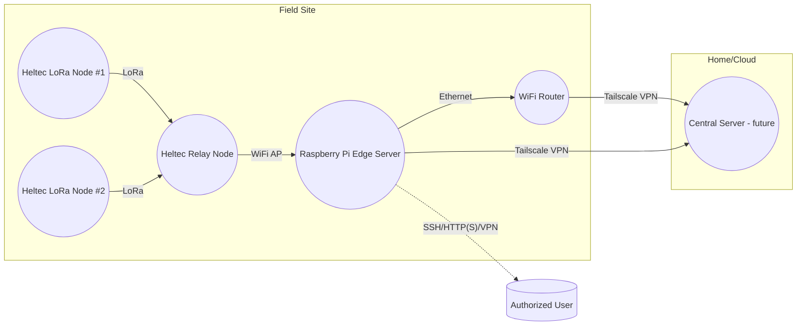
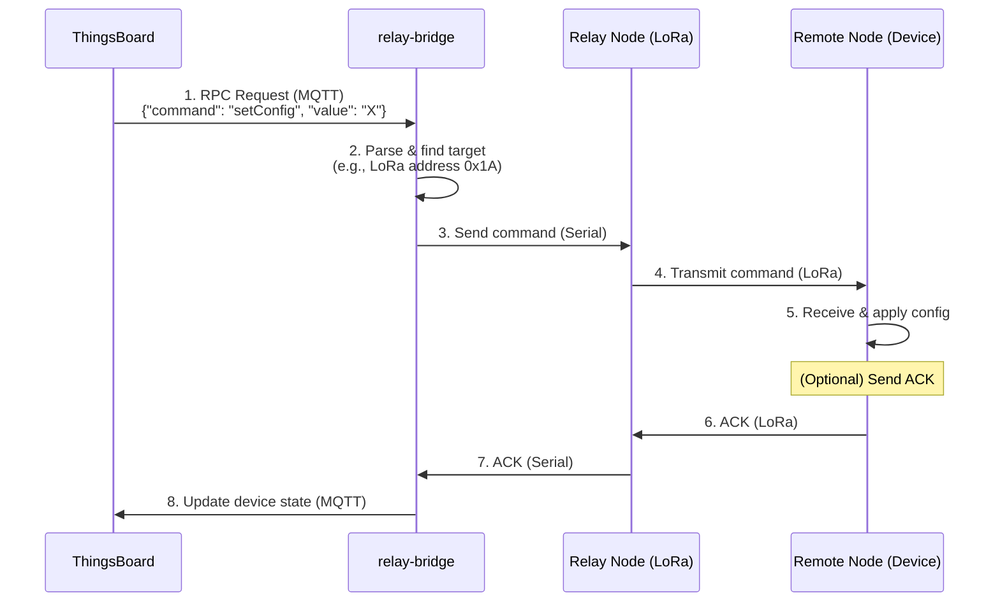

# Farm Monitoring System Documentation

This document provides a comprehensive overview of the farm monitoring system, from high-level architecture to low-level implementation details.

## Table of Contents

1.  [System Overview](#1-system-overview)
2.  [Hardware](#2-hardware)
3.  [Firmware](#3-firmware)
    - [Remote Sensor Node (`remote`)](#31-remote-sensor-node)
    - [Relay Node (`relay`)](#32-relay-node)
4.  [Communication Protocols](#4-communication-protocols)
5.  [Raspberry Pi Setup](#5-raspberry-pi-setup)
6.  [Deployment Guide](#6-deployment-guide)
7.  [Maintenance and Extensibility](#7-maintenance-and-extensibility)

## 1. System Overview

The farm monitoring system is a modular, resilient platform that consolidates resources and plugs into ERPNext (or any farm ERP) for unified record-keeping and analytics.

### 1.1. System Topology

The system is composed of remote sensor nodes that collect data and transmit it to a central on-site server (Raspberry Pi) via a relay node.



### 1.2. Layered Architecture

#### A. Physical Layer

| Component | Details |
| :--- | :--- |
| Remote Heltec | WiFi LoRa 32 (V3), deployed in the remote field. |
| Relay Heltec | WiFi LoRa 32 (V3), located near the Raspberry Pi. |
| Raspberry Pi | Model 3/4, runs all edge services. |
| WiFi Router | Provides local networking at the farm site. |
| Sensors | Sunverter 4b (RS485/Serial), water flow/level, env sensors. |
| Power | Mains/solar as per site requirements. |

#### B. Data & Communication Layer

| Path | Protocol | Details |
| :--- | :--- | :--- |
| Remote Heltec → Relay Heltec | LoRa (Semtech) | Uplink sensor data, 433/868/915 MHz as per region. |
| Relay Heltec → Pi | WiFi (TCP/UDP) | Connects to Pi WiFi Access Point; Tasmota web UI and MQTT. |
| Pi → Internet | Ethernet | Connected to farm router via LAN cable for internet access. |
| Pi → MQTT/Node-RED/InfluxDB | Internal Docker Network | Containerized services managed by Coolify. |
| Pi ↔ User | HTTPS via Tailscale VPN | Dashboard, SSH admin, secured by Tailscale VPN. |
| Pi ↔ Coolify VPS | SSH via Tailscale VPN | Deployment, monitoring, and management. |

#### C. Logical/Software Layer

| Layer/Module | Description |
| :--- | :--- |
| Remote Firmware | Configurable firmware for sensor reading, data packing, and LoRa TX/config RX. |
| Relay Firmware | Tasmota-based firmware with LoRa capabilities, WiFi networking, and web UI. |
| Pi Edge Stack | Coolify-managed containers: Mosquitto MQTT, Node-RED, InfluxDB, Tailscale agent. |
| Pi Network Stack | WiFi Access Point (hostapd) + Ethernet connection for internet access. |
| Shared Protocols | All nodes use the same serialization/packing from `/shared`. |
| Management Layer | Coolify VPS orchestrates deployments, updates, and monitoring via Tailscale VPN. |
| User Interface | Node-RED Dashboard, Grafana (optional), SSH access via Tailscale VPN. |

### 1.3. Information Flow

#### A. Sensor Data Path (Uplink)

1.  **Remote Heltec**:
    -   Reads data from all attached sensors (e.g., Sunverter 4b, tank level, flow meters).
    -   Packs the readings into a fixed-format binary structure.
    -   Transmits the data packet over LoRa to the relay node at a predefined interval.
2.  **Relay Heltec**:
    -   Listens for incoming LoRa packets from remote nodes.
    -   Connects to Pi WiFi Access Point and forwards sensor packets via TCP/UDP.
3.  **Raspberry Pi (Edge Server)**:
    -   Mosquitto MQTT broker receives data from relay via WiFi network.
    -   Node-RED processes and routes data to InfluxDB for storage.
    -   Dashboard services provide real-time visualization.
4.  **User**:
    -   Connects to the system via Tailscale VPN to access Node-RED dashboard and administrative functions (SSH).

#### B. Configuration & Downlink Path

1.  **User/Node-RED Dashboard**:
    -   The user sends configuration changes (e.g., sample rate, sensor settings) via the Node-RED dashboard.
2.  **Node-RED → MQTT → Relay Heltec**:
    -   Node-RED publishes configuration commands to MQTT topics.
    -   The relay node subscribes to configuration topics via WiFi connection.
3.  **Relay Heltec → Remote Heltec**:
    -   The relay node broadcasts the configuration packet over LoRa and waits for an acknowledgment.
4.  **Remote Heltec**:
    -   Listens for configuration updates after each transmission.
    -   If a valid configuration is received, it is stored in flash memory, and an ACK is sent in the next uplink.
5.  **Status Reporting**:
    -   Configuration confirmations flow back through the same path to update the dashboard.

## 2. Hardware

This section details the hardware components used in the farm monitoring system.

### 2.1. Core Components

| Component | Model | Role |
| :--- | :--- | :--- |
| Edge Server | Raspberry Pi 3 or 4 | Hosts ThingsBoard and the relay bridge. |
| Remote Node | Heltec WiFi LoRa 32 (V3) | Collects sensor data in the field. |
| Relay Node | Heltec WiFi LoRa 32 (V3) | Relays data between remote nodes and the Pi. |

### 2.2. Sensor Details

The system supports a variety of sensors, which are configured in the remote node's firmware.

-   **Sunverter 4b**: Connected via a [TTL-to-RS485 converter](https://www.pixelelectric.com/electronic-modules/miscellaneous-modules/logic-converter/ttl-to-rs485-automatic-control-module/) for monitoring solar power systems.
-   **Water Level Sensors**: Analog or ultrasonic sensors for tank monitoring.
-   **Flow Meters**: Pulse-based sensors to measure water flow at critical points:
    -   Borehole to tank
    -   Tank to domestic supply
    -   Tank to farm
    -   Domestic supply to sales
-   **Environmental Sensors**: Optional sensors for temperature, humidity, etc.

### 2.3. Power Systems

-   **Remote Node Power**: Each remote node is powered by a small, repurposed solar panel, a charging circuit, and a single 18650 battery cell. This setup is designed for high availability in a region with abundant sun, providing up to 3 days of autonomy in worst-case scenarios.
-   **Raspberry Pi Power**: The Pi is housed indoors and connected to a UPS or battery backup for resilience against power outages.

### 2.4. Physical Deployment

-   **Remote Nodes**:
    -   Placed at sensor cluster points (e.g., by the borehole, water tank).
    -   The LoRa antenna should be positioned for optimal line-of-sight to the relay node.
-   **Relay Node**:
    -   Located near the Raspberry Pi, typically indoors.
    -   Connected to the Pi via USB.
    -   Positioned for the best possible LoRa reception from all remote nodes.
-   **Raspberry Pi**:
    -   Housed indoors, protected from dust and moisture.
    -   Connected to the local network via Ethernet or WiFi.

## 3. Firmware

This section provides a high-level overview of the firmware for the remote and relay nodes.

### 3.1. Remote Sensor Node (`remote`)

The remote node's firmware is designed for minimal power consumption and reliable, config-driven operation. It collects data from sensors and transmits it to the relay node.

#### Responsibilities

-   **Collect data** from attached sensors (Sunverter, tank level, flow meters, etc.).
-   **Package readings** into a compact payload for LoRa transmission.
-   **Transmit** data at fixed intervals.
-   **Listen** for downlink configuration packets to update settings.
-   **Persist** configuration in flash memory.
-   **Acknowledge** configuration changes in the next uplink.

#### Data Structures

The firmware uses a set of C++ structs to manage configuration.

##### `SensorConfig`

Defines a single sensor "slot."

```cpp
struct SensorConfig {
  uint8_t  slotId;        // 0..MAX_SLOTS-1
  uint8_t  pin;           // GPIO number
  uint8_t  type;          // 0=Digital, 1=Analog, 2=I2C, 3=OneWire,...
  uint16_t pollInterval;  // seconds
  float    scale;         // multiplier for raw value
  bool     enabled;       // true=active
};
```

##### `LoRaConfig`

Manages LoRa radio parameters.

```cpp
struct LoRaConfig {
  uint32_t freq;      // e.g. 868000000
  uint8_t  sf;        // 7..12
  uint32_t bw;        // Hz, e.g. 125000
  uint8_t  cr;        // 5..8 (4/5..4/8)
  uint16_t preamble;  // symbols
  int8_t   txPower;   // +2..+20 dBm
  uint8_t  syncWord;  // 0..255
};
```

##### `ConfigPacket`

The top-level configuration packet.

```cpp
struct ConfigPacket {
  uint8_t      version;
  LoRaConfig   lora;
  WiFiConfig   wifi;       // optional
  BLEConfig    ble;        // optional
  uint8_t      numSensors;
  SensorConfig sensors[MAX_SLOTS];
  uint16_t     crc16;      // CRC over all prior bytes
};
```

#### Storage and Persistence

Configuration is stored in the ESP32's Non-Volatile Storage (NVS).

-   Configurations are loaded at boot.
-   New configurations received via LoRa are written to NVS.
-   Writes are batched to minimize flash wear.
-   A `pendingReboot` flag can be set in NVS to trigger a restart after a config update.

#### Boot and Initialization Flow

```cpp
void setup() {
  Serial.begin(115200);
  initLoRa();
  loadDefaultConfigs();
  loadSavedConfigs();    // Override from NVS if valid
  applyConfigs();
  if (checkPendingReboot()) ESP.restart();
  scheduleNextPoll();
}
```

#### Main Loop Pseudocode

```cpp
void loop() {
  // 1. Poll sensors on schedule
  for each slot in sensorTable:
    if (timeToPoll(slot)) {
      value = readSensor(slot);
      scaled = value * slot.scale;
      storeUplinkData(slot.slotId, scaled);
    }

  // 2. Transmit when uplink window is open
  if (uplinkTime()) {
    packet = packUplinkData();
    LoRa.beginPacket();
    LoRa.write(packet, packetLen);
    LoRa.endPacket();

    // 3. Open RX window for config download
    if (LoRa.parsePacket(timeoutMs)) {
      incoming = readConfigPacket();
      if (validateCRC(incoming)) {
        applyNewConfig(incoming);
        saveConfigToNVS(incoming);
        setPendingReboot(); // Optional
      }
    }
  }

  // 4. Handle background tasks
  handleNVMSTasks();
  yield();
}
```

### 3.2. Relay Node (`relay`)

The relay node acts as a bridge between the LoRa network and the Raspberry Pi. It forwards data between the two and handles configuration updates using Tasmota firmware for enhanced configurability.

#### Responsibilities

-   **LoRa Uplink**: Receives sensor data from all remote nodes via LoRa.
-   **WiFi Forwarding**: Forwards the received LoRa packets to the Raspberry Pi via WiFi/MQTT.
-   **Configuration Management**: Receives configuration commands from the Pi via MQTT or web interface.
-   **LoRa Downlink**: Broadcasts the configuration commands to the remote nodes via LoRa.
-   **Status Reporting**: Handles acknowledgments from remote nodes and reports their status upstream to the Pi.
-   **Web Interface**: Provides Tasmota web UI for direct configuration and monitoring.

#### Main Loop Pseudocode

```cpp
void loop() {
  // 1. Check for incoming LoRa packets (uplink)
  if (LoRa.parsePacket()) {
    loraPacket = readLoRaPacket();
    // Forward the packet to the Pi via serial
    Serial.write(loraPacket, loraPacket.length);
  }

  // 2. Check for incoming serial data (downlink)
  if (Serial.available() > 0) {
    serialPacket = readSerialPacket();
    // Broadcast the packet to remote nodes via LoRa
    LoRa.beginPacket();
    LoRa.write(serialPacket, serialPacket.length);
    LoRa.endPacket();
  }

  // 3. Handle background tasks (e.g., status LEDs)
  updateStatusIndicators();
  yield();
}
```

#### Firmware

This Arduino sketch is designed for a Heltec LoRa 32 device that acts as a relay.

##### Features

-   **Dynamic Configuration**: Manages settings using a `config.json` file stored in the device's LittleFS flash memory.
-   **First-Run Setup**: If no configuration file is found on boot, a new one is created with default settings.
-   **Extensible**: The configuration system is built to be easily extendable with new settings in the future.
-   **Debug Mode**: Includes a `debugMode` flag in the configuration to simulate success scenarios for testing without needing full hardware setup.

##### Default Configuration

On the first run, `config.json` will be created with:

```json
{
  "debugMode": true,
  "usbBaudRate": 115200
}
```

##### Dependencies

This project relies on the following Arduino libraries:

-   `ArduinoJson`: For handling JSON serialization and deserialization.
-   `LittleFS`: For file system management on the ESP32.

You will need to install these libraries through the Arduino IDE's Library Manager.

##### How to Use

1.  Open the `edge/heltec/relay/relay.ino` sketch in the Arduino IDE.
2.  Install the required libraries from the Library Manager.
3.  Select the correct board (Heltec LoRa 32) and port.
4.  Upload the sketch to your device.
5.  Open the Serial Monitor to view the output. The default baud rate for initial messages is 115200. The sketch will re-initialize the serial port based on the `usbBaudRate` in the `config.json` file.

## 4. Communication Protocols

This section outlines the communication protocols used in the farm monitoring system.

### 4.1. Uplink: Device to Server

Uplink communication sends sensor data from the end devices to the server.

1.  **Sensor Reading**: The remote node reads data from its sensors.
2.  **LoRa Transmission**: The data is broadcast as a LoRa packet.
3.  **Relay Reception**: The relay node receives the LoRa packet and writes it to its serial port.
4.  **Bridge Processing**: The `relay-bridge` reads the data from the serial port.
5.  **ThingsBoard Telemetry**: The `relay-bridge` publishes the data to the ThingsBoard MQTT broker on the `v1/devices/me/telemetry` topic.

### 4.2. Downlink: Server to Device (Configuration Updates)

Downlink communication sends commands or configuration updates from the server to the end devices. This is typically initiated via a **Remote Procedure Call (RPC)** from the ThingsBoard dashboard.

#### 4.2.1. Flow



#### 4.2.2. Description

1.  **RPC from ThingsBoard**: An operator sends a command to a device from the ThingsBoard dashboard. ThingsBoard publishes this as an MQTT message to the `v1/devices/me/rpc/request/+` topic.
2.  **`relay-bridge` Receives**: The `relay-bridge` is subscribed to this topic. It receives the message and parses the command.
3.  **Command to Serial**: The `relay-bridge` translates the command into a format understood by the relay node and sends it over the serial port. This includes the address of the target LoRa device.
4.  **LoRa Transmission**: The relay node transmits the command as a LoRa packet.
5.  **Device Execution**: The target remote node receives the packet, verifies its address, and executes the command.
6.  **Acknowledgement (Optional)**: The device can send an acknowledgement back to the `relay-bridge`, which can then update the RPC status in ThingsBoard.

## 5. Raspberry Pi Setup

The Raspberry Pi serves as the edge server for the farm monitoring system. It runs containerized services (Mosquitto MQTT, Node-RED, InfluxDB) managed by Coolify via SSH deployment. The Pi operates with dual WiFi configuration: client mode for internet access and access point mode for Heltec relay connectivity.

### 5.1. Architecture

The Pi edge server provides multiple essential functions:
- **Dual WiFi Networking**: Connects to farm WiFi (internet) while hosting access point for relay devices
- **Tailscale VPN Agent**: Provides secure remote access and management via VPN tunnel
- **Containerized Services**: MQTT broker, automation engine, time-series database
- **Remote Management**: Coolify VPS manages deployments, updates, and monitoring

#### 5.1.1. Network Configuration

**Ethernet Connection (eth0)**:
- Connects to farm router via LAN cable for internet access
- Provides upstream connectivity for Tailscale VPN and Coolify management
- Handles software updates and remote monitoring
- More reliable than WiFi for critical infrastructure

**WiFi Access Point Mode (wlan0)**:
- Hosts dedicated network for Heltec relay device(s)
- Isolated from main farm network for security
- Provides reliable local connectivity for sensor data collection
- DHCP server assigns static IPs to known devices

#### 5.1.2. Coolify Management

All services are deployed and managed using a Coolify VPS instance that connects via Tailscale VPN:
- **GitOps Workflow**: Changes pushed to git trigger automatic deployments
- **SSH-based Deployment**: Coolify connects via Tailscale to deploy Docker containers
- **Service Monitoring**: Health checks and automatic restart of failed services
- **Zero-downtime Updates**: Rolling updates without service interruption

### 5.2. Project Structure

The Pi configuration and deployment files are located in the `edge/pi/` directory.

| File/Folder | Description |
| :--- | :--- |
| `docker-compose.yml` | Main Docker Compose stack for Coolify deployment. |
| `config.yaml` | Configuration file for service parameters. |
| `setup_scripts/` | Shell scripts for Pi initial setup, Ethernet + WiFi AP configuration. |
| `mosquitto/` | Mosquitto MQTT broker configuration files. |
| `nodered/` | Node-RED flows and configuration (mounted volumes). |
| `docs/` | Pi-specific documentation and troubleshooting guides. |

### 5.3. Configuration

Service configuration is managed through the Docker Compose file and environment variables. Each service has specific configuration requirements:

#### 5.3.1. Service Configuration

**Mosquitto MQTT Broker**:
- Configuration files mounted from `/srv/mosquitto/config/`
- Persistent data storage in `/srv/mosquitto/data/`
- Access control and authentication settings

**Node-RED Automation Engine**:
- Flows and configuration stored in `/srv/nodered-data/`
- Dashboard UI accessible on port 1880
- MQTT client configuration for broker connectivity

**InfluxDB Time-Series Database**:
- Database files stored in `/srv/influx/`
- Bucket configuration for data retention
- API tokens for secure access

#### 5.3.2. Network Configuration

The Pi requires specific network configuration for Ethernet + WiFi AP operation:

```yaml
# Example configuration for network interfaces
network:
  ethernet:
    interface: eth0
    dhcp: true  # or static IP configuration
    network: "192.168.1.0/24"
  wifi_ap:
    interface: wlan0
    ssid: "FARM_RELAY"
    network: "10.42.0.0/24"
    dhcp_range: "10.42.0.100,10.42.0.200"
```

### 5.4. Deployment

The entire stack is deployed via Coolify using a GitOps workflow:

1. **Code Changes**: Push changes to the main git repository
2. **Automatic Detection**: Coolify detects changes and triggers deployment
3. **SSH Connection**: Coolify connects to Pi via Tailscale VPN
4. **Service Deployment**: Docker Compose stack is updated with zero downtime
5. **Health Monitoring**: Services are monitored for successful deployment

#### 5.4.1. Automated Pi Setup

The Pi setup is automated using the `setup_farm_pi.sh` script which handles:
- System updates and essential package installation
- Tailscale VPN installation and configuration
- Docker and Coolify installation
- WiFi hotspot setup for Heltec device connectivity
- Repository cloning and script preparation

**One-line installation:**
```bash
curl -sSL https://github.com/yourusername/farm/raw/main/edge/pi/setup_farm_pi.sh | bash
```

**WiFi Hotspot Management:**
```bash
# Check connected Heltec devices
sudo ./edge/pi/wifi_hotspot.sh check

# Reconfigure hotspot if needed  
sudo ./edge/pi/wifi_hotspot.sh setup
```

### 5.5. Service Stack

The containerized service stack provides complete monitoring functionality:

**Mosquitto MQTT Broker**:
- Handles all device communication
- Provides reliable message queuing
- Supports authentication and access control

**Node-RED Automation Platform**:
- Processes incoming sensor data
- Provides dashboard interface for monitoring
- Implements automation rules and alerts
- Manages device configuration and commands

**InfluxDB Time-Series Database**:
- Stores all historical sensor data
- Provides data retention policies
- Supports efficient queries for analytics
- Integrates with Grafana for advanced visualization

## 6. Deployment Guide

This guide provides a step-by-step process for deploying the farm monitoring system.

### 6.1. Deployment Sequence

#### **Phase 1: Raspberry Pi Infrastructure Setup**
1. **Install Raspbian OS** on Pi (use Pi Imager with SSH enabled)
2. **Run automated setup**: `curl -sSL https://github.com/yourusername/farm/raw/main/edge/pi/setup_farm_pi.sh | bash`
3. **Complete Tailscale authentication** when prompted
4. **Setup Coolify** via web interface at `http://<tailscale-ip>:8000`
5. **Deploy Docker stack** using Coolify's git integration

#### **Phase 2: Network Infrastructure Verification**
1. **Verify WiFi hotspot**: `sudo ./edge/pi/wifi_hotspot.sh check`
2. **Confirm MQTT broker** is running: `docker ps | grep mosquitto`
3. **Test Node-RED dashboard**: Access at `http://<tailscale-ip>:1880`

#### **Phase 3: Heltec Device Setup**
1. **Flash Relay Node** firmware from `edge/heltec/relay/`
2. **Configure Relay Node** to connect to Pi hotspot network (SSID: `PiHotspot`)
3. **Flash Remote Sensor Nodes** firmware from `edge/heltec/remote/`
4. **Deploy Remote Nodes** at sensor locations with LoRa connectivity to relay

#### **Phase 4: System Verification**
1. **Check device connectivity**: Monitor hotspot connections and MQTT traffic
2. **Verify data flow**: Confirm sensor data reaches InfluxDB via Node-RED
3. **Test remote access**: Access dashboards via Tailscale from anywhere

### 6.3. Security Configuration

**Network Security**:
- **Tailscale VPN**: All remote access (dashboard, SSH, deployment) routed through secure VPN tunnel
- **Zero Public Ports**: No services exposed directly to internet; access only via Tailscale
- **Network Isolation**: Relay WiFi AP isolated from main farm network
- **Encrypted Communication**: LoRa mesh uses encryption; WiFi networks use WPA3

**Access Control**:
- **SSH Key Authentication**: Password authentication disabled; key-based access only
- **Coolify User Separation**: Dedicated user account for deployment operations
- **Service Authentication**: MQTT and database access require authentication
- **Device Authorization**: Only authorized Heltec devices can connect to relay network

**Physical Security**:
- **Pi Housing**: Raspberry Pi secured in weatherproof enclosure with tamper detection
- **Relay Protection**: Relay node in protected location with backup power
- **Remote Node Security**: Field sensors in tamper-evident enclosures where possible
- **Backup Strategy**: Automated data backup via Tailscale to remote storage

## 7. Maintenance and Extensibility

This section provides guidance on maintaining and extending the farm monitoring system.

### 7.1. Maintenance

#### Critical Dependencies

| Layer | What Breaks if It Fails | Recovery Plan |
| :--- | :--- | :--- |
| Remote Node | No data from sensors | Manual visit for repair or replacement (rare). |
| Relay Node | No LoRa uplink/downlink | Replace, or bypass with a Pi LoRa Hat. |
| Raspberry Pi | No data collection/dashboard | Restore from an SD card image; keep a spare Pi on hand. |
| WiFi Router | No dashboard/SSH/VPN access | A spare/backup router is recommended. |
| Tailscale | No remote access | System runs in local-only mode; fix WAN access ASAP. |

#### Data Backup and Sync

-   Scheduled backups and exports from the Raspberry Pi to a home server can be configured via Tailscale, SFTP, or a custom sync script.

### 7.2. Extensibility

#### Adding New Sensors

- **Remote Configuration**: Update sensor configurations via Node-RED dashboard
- **LoRa Downlink**: Send new configurations through relay node to remote nodes
- **Firmware Updates**: OTA updates can be pushed via LoRa mesh if supported
- **New Sensor Types**: Add support by updating remote node firmware and Node-RED flows

#### Adding More Remote Nodes

- **Scalable Architecture**: System supports multiple remote nodes with unique LoRa addresses
- **Auto-Discovery**: New nodes can auto-register with system upon first connection
- **Load Balancing**: Multiple relay nodes can be deployed for larger coverage areas
- **Mesh Networking**: Nodes can relay data for extended range

#### Network Expansion

- **Additional WiFi APs**: Deploy multiple Pi units for extended coverage
- **Mesh WiFi**: Use mesh WiFi system for improved relay node connectivity
- **LoRa Range Extension**: Add repeater nodes for long-distance sensor deployment
- **Multiple Site Support**: Coolify can manage multiple farm sites from single VPS

#### Integration Capabilities

- **API Integration**: Node-RED flows can integrate with external APIs and services
- **Database Expansion**: Additional databases (PostgreSQL, Redis) can be added to stack
- **Third-party Services**: Integration with weather APIs, irrigation systems, ERPNext
- **Mobile Apps**: Develop mobile applications using Node-RED dashboard or custom APIs
- **Alert Systems**: SMS, email, Telegram notifications via Node-RED integrations

---

## 9. SSH Tunneling for Remote Device Access

This section covers how to securely access Heltec device web interfaces remotely using SSH tunneling through the Raspberry Pi.

### 9.1. SSH Tunneling Setup

#### **Steps:**

1. **Find Heltec IP:**
   ```bash
   sudo apt install nmap
   nmap -sn 10.42.0.0/24
   ```

2. **Create Tunnel:**
   ```bash
   ssh -L 8080:10.42.0.247:80 pi@raspberrypi
   ```

3. **Access Web UI:**
   ```
   http://localhost:8080
   ```

### 9.2. Edge Cases & Solutions

| **Issue**               | **Solution**                                                                 |
|-------------------------|-----------------------------------------------------------------------------|
| Heltec IP changes        | Assign static IP to Heltec device via router or Pi DHCP configuration.     |
| Pi Tailscale IP changes  | Use hostname: `pi@raspberrypi.tailscale.net`.                              |
| SSH drops                | Use `autossh`: `autossh -M 0 -L 8080:10.42.0.247:80 pi@raspberrypi`.       |
| Port conflict            | Change local port: `ssh -L 8081:10.42.0.247:80 pi@raspberrypi`.            |

### 9.3. Scalability

1. **Multiple Devices:**
   ```bash
   ssh -L 8080:10.42.0.247:80 pi@raspberrypi
   ssh -L 8081:10.42.0.248:80 pi@raspberrypi
   ```

2. **Automation Script:**
   ```bash
   #!/bin/bash
   ssh -L 8080:10.42.0.247:80 pi@raspberrypi
   ```

3. **Persistent Tunnels:**
   ```bash
   tmux new-session -d 'ssh -L 8080:10.42.0.247:80 pi@raspberrypi'
   ```

### 9.4. Security Considerations

- **SSH Keys**: Use key-based authentication: `ssh-copy-id pi@raspberrypi`
- **Heltec Security**: Secure Tasmota web UI with authentication and firewall rules
- **Network Isolation**: Ensure relay network remains isolated from farm network
- **Access Logging**: Monitor SSH access and tunnel usage for security auditing

### 9.5. Tasmota Web Interface Access

The SSH tunnel provides access to the Tasmota web interface on Heltec devices:
- **Configuration Management**: GPIO settings, WiFi configuration, device parameters
- **OTA Updates**: Firmware updates without physical access to devices
- **Real-time Monitoring**: Device status, sensor readings, and system information
- **Command Interface**: Execute Tasmota commands remotely via web console

### 9.6. Summary

| **Aspect**         | **Details**                                                                 |
|---------------------|-----------------------------------------------------------------------------|
| **Reproducibility** | Static IPs, documented commands, automation scripts.                       |
| **Edge Cases**      | Handle IP changes, SSH drops, port conflicts with documented solutions.    |
| **Scalability**     | Multiple devices, automation, persistent tunnels for production use.       |
| **Security**        | SSH keys, device authentication, network isolation, access monitoring.     |
